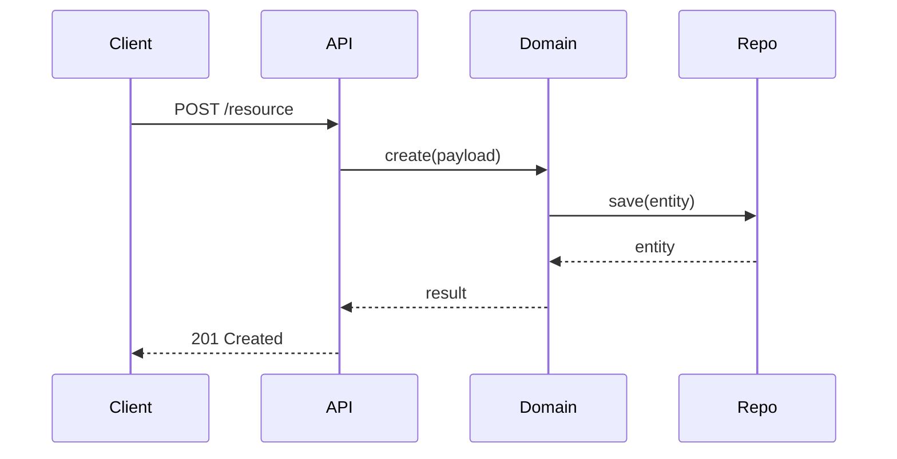

# Architecture — <slug>

## Module Decomposition

<One row per module, placed per ADR-0001. The example rows show a hexagonal feature.>

| Module | Responsibility | Imports |
|---|---|---|
| `src/<package>/<feature>/domain.py` | Pure business logic | (stdlib only) |
| `src/<package>/<feature>/repository.py` | DB adapter | `domain`, `sqlalchemy` |
| `src/<package>/<feature>/api.py` | HTTP entry point | `domain`, `fastapi` |

## Directory Tree

<New and changed files only, in Real Python tree format.>

```
<project>/
│
├── src/
│   │
│   └── <package>/
│       │
│       └── <feature>/
│           ├── __init__.py
│           ├── api.py
│           ├── domain.py
│           └── repository.py
│
└── tests/
    │
    └── <feature>/
        ├── __init__.py
        ├── test_api.py
        ├── test_domain.py
        └── test_repository.py
```

## Key Decisions
- ADR-NNNN: <title> — one-line summary
- ADR-NNNN: <title> — one-line summary

## Library Choices

| Need | Choice | Rationale |
|---|---|---|
| HTTP | FastAPI | Already in `pyproject.toml`; matches spec's OpenAPI requirement |
| DB | SQLAlchemy 2.x | Existing convention |

## Diagrams



## Architecture Enforcement

(Layered or hexagonal style only; omit this section for simple modules.) import-linter contracts. The walking-skeleton task adds them to `pyproject.toml` together with the modules they constrain. `root_packages` stays the project package, `[<package>]`, set by `/env-bootstrap`. Module paths start at the package (`<package>.<feature>.domain`), not at `src`.

```toml
[[tool.importlinter.contracts]]
name = "Domain has no I/O"
type = "forbidden"
source_modules = ["<package>.<feature>.domain"]
forbidden_modules = ["<package>.<feature>.repository", "<package>.<feature>.api", "sqlalchemy", "fastapi", "requests", "httpx"]
```
