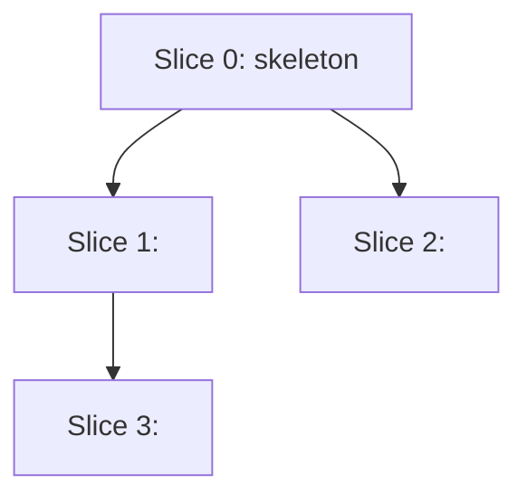

# Implementation Plan — <slug>

## Walking Skeleton (Slice 0)
- [ ] Dependencies: `uv add <package>` for each new library in `architecture.md`'s *Library Choices* (changes `pyproject.toml` and `uv.lock`)
- [ ] Create `src/<package>/<feature>/__init__.py` and `tests/<feature>/__init__.py`
- [ ] Shared test fixtures in `tests/conftest.py`, if later slices need them
- [ ] Stub `src/<package>/<feature>/domain.py` with the simplest no-op matching spec example 1
- [ ] Stub `src/<package>/<feature>/api.py` route returning a hardcoded response
- [ ] `tests/<feature>/test_smoke.py` — end-to-end happy-path against the stub
- [ ] `pyproject.toml` — add the import-linter contracts from `architecture.md`, if any

## Vertical Slices

### Slice 1 — <behavior name from spec>
- [ ] `tests/<feature>/test_domain.py::test_<spec example 1>` — write failing test
- [ ] `src/<package>/<feature>/domain.py::<function>` — implement to pass test
- **Reuse:** `src/<package>/common/result.py::Result` (existing) for return type
- **Depends on:** Slice 0

### Slice 2 — <next behavior>
- [ ] …
- **Depends on:** Slice 1

## Dependency Graph

## Files Touched (change order)

| Order | File | Purpose | New / Modified |
|---|---|---|---|
| 1 | `src/<package>/<feature>/__init__.py` | package marker | new |
| 2 | `src/<package>/<feature>/domain.py` | core logic | new |
| 3 | `tests/<feature>/test_domain.py` | tests | new |

## Test List

| Test name | Spec example # | Slice |
|---|---|---|
| `test_user_lookup_returns_none_for_unknown_id` | 1 | Slice 1 |

## Reuse Inventory

| Existing | Use for |
|---|---|
| `src/<package>/common/result.py::Result` | Return type in domain |
| `src/<package>/db/session.py::session_scope` | DB transaction handling |
