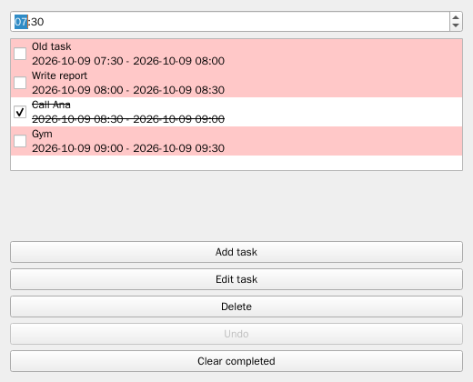

# todo-qt

A desktop to-do list for planning your day, built with Python and Qt
([PySide6](https://doc.qt.io/qtforpython-6/)). It runs on Linux and macOS.



Each task has a title, a start and end time, and a done checkbox. The list is
a timeline: drag a task to a new place, and the tasks below it are rescheduled
back to back.

## Features

- **Timed tasks.** A new task starts at the next full hour and lasts
  30 minutes. It goes at the bottom of the list, and you can change its title
  and times before you confirm.
- **Edit in place.** Double-click a task, or select it and click **Edit task**,
  to change its title or times. Press Enter in the title field to confirm.
- **Drag to reorder.** The moved task and every task below it are rescheduled
  back to back, keeping their durations.
- **Day start.** The time box at the top sets when your day begins (09:00 by
  default). Changing it reschedules the whole list from that time.
- **Done and overdue.** Done tasks are struck through. Unfinished tasks whose
  end time has passed are highlighted, and the highlight updates on its own
  within a minute.
- **Delete and undo.** Delete a task with **Delete** or the Delete key
  (Backspace on macOS), or remove every done task with **Clear completed**.
  **Undo** (Ctrl+Z, or Cmd+Z on macOS) brings back the last delete or clear.
- **Auto-save.** Every change is saved right away and restored the next time
  you open the app.

## Requirements

- Python 3.14 or later
- [uv](https://docs.astral.sh/uv/)
- Linux or macOS

On a minimal Linux install, Qt may need a few system libraries. On Ubuntu or
Debian:

```console
$ sudo apt-get install libegl1 libgl1 libxkbcommon0 libdbus-1-3 libfontconfig1 libglib2.0-0t64
```

## Install and run

Install the `todo-qt` command straight from GitHub:

```console
$ uv tool install git+https://github.com/lpozo/todo-qt
$ todo-qt
```

Or run it from a clone:

```console
$ git clone https://github.com/lpozo/todo-qt.git
$ cd todo-qt
$ uv run todo-qt
```

`todo-qt` takes no arguments.

## Where your tasks are saved

Tasks are saved to `tasks.json` in your user data folder:

| Platform | Folder |
|---|---|
| Linux | `$XDG_DATA_HOME/todo-qt`, or `~/.local/share/todo-qt` if `XDG_DATA_HOME` isn't set |
| macOS | `~/Library/Application Support/todo-qt` |

To use a different folder, set `TODO_QT_DATA_DIR`:

```console
$ TODO_QT_DATA_DIR=~/Documents/todo todo-qt
```

The file and the folder the app creates are readable only by you. Each save
replaces the file in one step, so a crash mid-save can't leave a half-written
file.

If the file can't be read, the app starts with an empty list and tells you so.
It never overwrites the unreadable file. Before the next save, the file is
renamed to `tasks.<date-time>.corrupt` in the same folder, so you can recover
it. If a save fails, for example because the disk is full, the app says so and
keeps your change in the list.

## Development

Install the project and its development tools, then the Git hooks:

```console
$ uv sync
$ uv run pre-commit install --install-hooks
```

The hooks run the same checks as CI:

- **On commit:** ruff (lint and format), bandit, gitleaks, and a Conventional
  Commits check on the message.
- **On push:** mypy and pytest.

To run the checks yourself:

```console
$ uv run pre-commit run --all-files   # ruff, ruff format, bandit, gitleaks
$ uv run mypy src                     # strict type checking
$ uv run lint-imports                 # architecture contracts
$ uv run pytest -n auto --cov --cov-branch
```

The GUI tests use [pytest-qt](https://pytest-qt.readthedocs.io/) with Qt's
offscreen platform, so they run without a display. Coverage must stay at 85%
or above.

### Architecture

The code in `src/todo_qt/` is split into layers, and each layer imports only
from the layers below it:

```text
cli                  starts the app and connects the parts
ui | persistence     Qt widgets  |  JSON file storage
services             PlanService: commands, auto-save, undo
domain               tasks, the timeline rules, overdue (stdlib only)
```

[import-linter](https://import-linter.readthedocs.io/) enforces these rules.
The contracts are in `pyproject.toml`. The design decisions are recorded as
ADRs in [`docs/adr/`](docs/adr/).

### How changes are made

Features go through a documented workflow: requirements, spec, architecture,
implementation plan, and tasks. The artifacts for each change live in
`docs/workflow/<change>/`, for example
[`docs/workflow/task-list/`](docs/workflow/task-list/). Each change is a pull
request with a Conventional Commits title (`feat(...)`, `fix(...)`,
`docs(...)`), and it's squash-merged into `main`.

See [`CHANGELOG.md`](CHANGELOG.md) for what has changed.

## License

MIT
