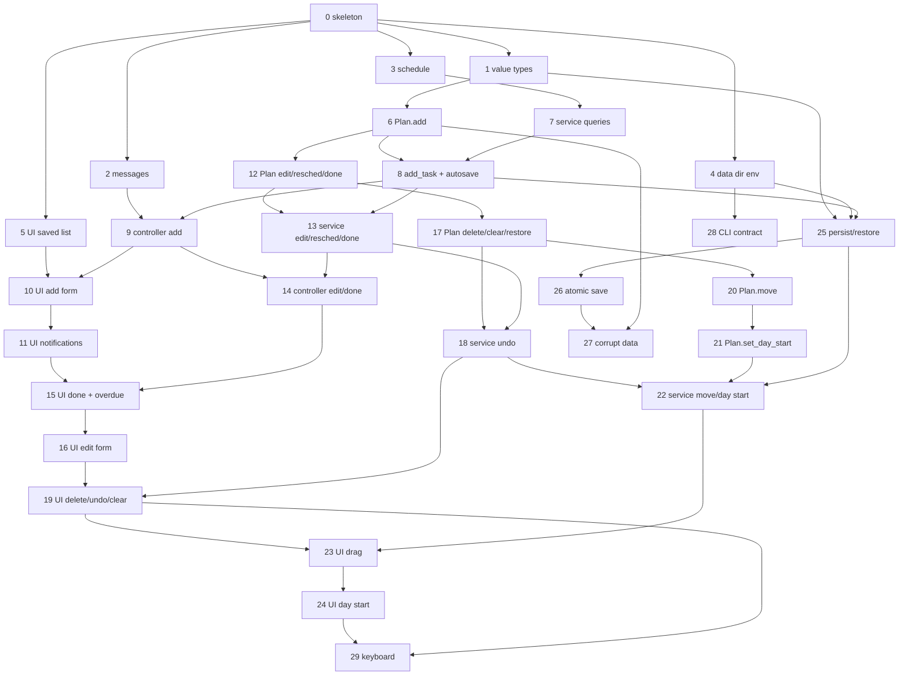

# Implementation Plan — task-list

Inputs: `spec.md`, `architecture.md`, ADR-0001..0006. Paths: `src/todo_qt/...` is written as `src:...`
and `tests/task_list/...` as `t:...` in the tables below (`tests/task_list/` has an `__init__.py`).
Every spec example name below is the pytest function name with a `test_` prefix.

## How to read this plan (for Phase 5)

- The slices are a **single DAG**. A file that more than one slice modifies is always touched in a
  fixed chain of slices connected by dependency edges (see "File ownership chains"), never in parallel.
  Phase 5 must keep those edges when it cuts tasks.
- Test files are **per slice** (a deviation from `architecture.md`'s shorter test list, which merged
  several behaviors per file). A test file is created by exactly one slice and never modified by
  another. Deviations from the architecture's test file names:
  `test_domain_plan.py` is split into `_add`, `_edit`, `_remove`; `test_domain_plan_move.py` keeps
  `move` and `set_day_start` moves to `test_domain_plan_day_start.py`; `test_service_commands.py` is
  split into `test_service_add.py`, `_edit.py`, `_move.py`, `_day_start.py`; `test_ui_window.py`,
  `test_ui_controller.py`, `test_ui_model.py` are split per behavior; `test_persistence_json_store.py`
  is split into four files; `test_cli_main.py` is split into five. Reason: non-overlapping task
  allow-lists and parallelism.
- A slice is "core" (domain + service, no Qt) or "UI". A behavior with both has a core slice and a UI
  slice, each 1-4 files. Every slice leaves `pytest`, `mypy src`, `ruff` green (`lint-imports` green
  from Slice 0e on).
- Examples that happen to pass on arrival (because the skeleton already behaves that way) are
  marked "(green on arrival)" in the slice; the rest are red first.

## Walking Skeleton (Slice 0)

Goal: `todo-qt` (via `main(..., run_ui=real)`) opens a `MainWindow` showing an **empty list** whose
data comes from a `JsonPlanStore` in a data dir, through a real `PlanService`. All shared-file edits
happen here. Slice 0 is large on purpose; it is cut into five sub-tasks with disjoint file sets
(Phase 5 should make each its own task; order 0a -> (0b, 0c in parallel) -> 0d -> 0e).

### 0a — Config, lockfile, CI (files: `pyproject.toml`, `uv.lock`, `.github/workflows/ci.yml`)
- [ ] `uv add "pyside6-essentials>=6.12,<7"` and `uv add --dev "pytest-qt>=4.5"` (updates `uv.lock`; CI uses `uv sync --locked`)
- [ ] `pyproject.toml`: `qt_api = "pyside6"` under `[tool.pytest.ini_options]`
- [ ] `pyproject.toml`: add the seven import-linter contracts from `architecture.md` verbatim
      (its *Architecture Enforcement* section was revised after planning: `todo_qt.cli` has its own
      "cli imports Qt only through ui" contract with `allow_indirect_imports = true`, and
      `PySide6.QtNetwork` was dropped because import-linter rejects sub-packages of external packages).
      Phase 3 should amend `architecture.md` accordingly.
- [ ] `.github/workflows/ci.yml` `test` job: add the apt step from architecture.md (before pytest)
- [ ] Leave `.pre-commit-config.yaml` unchanged (hooks already cover ruff, bandit, gitleaks, mypy, pytest)

### 0b — Test infrastructure (files: `tests/conftest.py`, `t:__init__.py`, `t:fakes.py`)
- [ ] `tests/conftest.py`: `os.environ.setdefault("QT_QPA_PLATFORM", "offscreen")` before any Qt import;
      autouse fixture `isolated_home` (monkeypatch `HOME`, `XDG_DATA_HOME` to `tmp_path`, delete
      `TODO_QT_DATA_DIR`, so no test touches the real home); fixtures `clock`, `new_id`, `fake_store`,
      `recording_store`, `data_dir`, `make_service`
- [ ] `t:fakes.py` (complete helper set so later slices never edit it): `FRI`, `T(h, m, day=...)`,
      `MutableClock` (settable, advanceable, returns naive datetimes), `IdCounter`, `make_slot`,
      `make_task`, `make_plan`, `FakeStore` (preloaded plan / `None` / raises `StoreCorruptError` on load;
      `save` records), `RecordingStore` (records every `save` call; optional exception to raise)
- [ ] `t:__init__.py` (empty)

### 0c — Domain skeleton (files: `src:domain/{__init__,errors,task,plan,schedule}.py`, `t:test_domain_plan_defaults.py`)
- [ ] `errors.py`: all exception classes complete (they are plain classes; `TaskNotFoundError`,
      `DuplicateTaskIdError` carry `task_id`; `IndexOutOfRangeError` carries `index`, `size`)
- [ ] `task.py`: `TaskId`, `TimeSlot` (fields + `duration`, no validation yet), `Task` (fields, no validation),
      `RemovedEntry`, `RemovedTasks` (no invariant yet), `normalize_title` (stub: `raise NotImplementedError`)
- [ ] `plan.py`: `DEFAULT_DAY_START`, frozen `Plan(tasks=(), day_start=DEFAULT_DAY_START)` with **no methods yet**
      (each behavior slice adds its own methods; this avoids stubs)
- [ ] `schedule.py`: `DEFAULT_SLOT_DURATION`; `default_slot` and `is_overdue` as stubs (`raise NotImplementedError`), exact final signatures
- [ ] `__init__.py`: **final** re-exports with `__all__` of the whole public domain API (errors, `TaskId`,
      `normalize_title`, `TimeSlot`, `Task`, `RemovedEntry`, `RemovedTasks`, `Plan`, `DEFAULT_DAY_START`,
      `DEFAULT_SLOT_DURATION`, `default_slot`, `is_overdue`). No later slice edits any domain `__init__.py`.
- [ ] Test: one spec example (default day start), green on arrival

### 0d — Services and persistence skeleton (files: `src:services/{__init__,errors,ports,plan_service}.py`, `src:persistence/{__init__,json_store,locations}.py`, `t:test_service_startup.py`, `t:test_persistence_json_store.py`, `t:test_persistence_locations.py`)
- [ ] `services/errors.py`: `StoreError(path, reason)`, `StoreCorruptError`, `StoreWriteError` (complete)
- [ ] `services/ports.py`: `PlanStore` Protocol, `PlanSnapshot`, `Clock`, `IdFactory` (complete)
- [ ] `services/plan_service.py`: `ChangeResult` (complete) and `PlanService` with `__init__` (one `load()`, corrupt ->
      empty plan + `startup_error`, never saves), `plan`, `startup_error`. No other members yet.
- [ ] `services/__init__.py`: **final** re-exports with `__all__` (errors, ports names, `ChangeResult`, `PlanService`)
- [ ] `persistence/locations.py`: `default_data_dir(environ, home, platform)` complete per ADR-0005
- [ ] `persistence/json_store.py`: `JsonPlanStore(directory, now=None)` implementing `PlanStore`; `load()` returns
      `None` when `tasks.json` is absent, otherwise `raise NotImplementedError`; `save()` `raise NotImplementedError`
- [ ] `persistence/__init__.py`: re-exports `JsonPlanStore`, `default_data_dir` (final; `codec` stays internal)
- [ ] Tests: startup examples, store-load-none example, plus additional locations tests (XDG set / relative XDG ignored /
      unset -> `~/.local/share/todo-qt` / darwin -> `~/Library/Application Support/todo-qt`)

### 0e — UI shell and composition root (files: `src:ui/{__init__,app,main_window,task_model,controller,messages}.py`, `src:cli.py`, delete `tests/test_cli.py`, `t:test_cli_main.py`, `t:test_smoke_launch.py`)
- [ ] `ui/controller.py`, `ui/messages.py`: **docstring-only placeholders**. They must exist in Slice 0 because the
      "UI controller and messages stay Qt-free" contract names them and import-linter fails on a missing module.
      Later slices modify them (they are not "new" then).
- [ ] `ui/task_model.py`: `TaskListModel(QAbstractListModel)` with `rowCount` from `service.plan` only
- [ ] `ui/main_window.py`: `MainWindow(service)` with a `QListView` on the model and an inert "Add task" button
- [ ] `ui/app.py`: `run_app(service) -> int` (reuse or create `QApplication`, show window, `exec()`); `ui/__init__.py` exports `run_app` only
- [ ] `cli.py` (modified): `DATA_DIR_ENV_VAR`, `resolve_data_dir` as a stub that returns `default_dir`, `system_clock`,
      `new_task_id`, `main(argv=None, *, environ=None, run_ui=None)` wiring: `default_data_dir(...)` ->
      `resolve_data_dir` -> `JsonPlanStore` -> `PlanService` -> `run_ui(service)`; default `run_ui` lazily imports
      `todo_qt.ui.run_app`; keeps `main()` callable without arguments and the `__main__` guard
- [ ] Delete `tests/test_cli.py` (its `main() == 0` assertion would start the event loop on the real data dir);
      the replacement is `t:test_cli_main.py` using `run_ui=fake`. Keep `tests/test_smoke.py`.
- [ ] `t:test_cli_main.py`: the exit-code example plus additional `test_main_wires_json_store_in_default_data_dir`
- [ ] `t:test_smoke_launch.py` (additional): `test_walking_skeleton_window_shows_empty_list_from_json_store` (real
      `JsonPlanStore(tmp_path)` -> `PlanService` -> `MainWindow`, zero rows, via `qtbot`) and
      `test_run_app_returns_zero_after_quit` (`QTimer.singleShot(0, app.quit)` before `run_app`)
- [ ] After 0e: `uv run lint-imports`, `mypy src`, `pytest` all green

## Vertical Slices

Notation: "Depends on" lists direct predecessors only (transitive ones are implied). "Files" is the exact
allow-list. N = new, M = modified. Example counts refer to the Test List.

### Slice 1 — Value types: title, time slot, task
- Files: M `src:domain/task.py`; N `t:test_domain_task.py`
- [ ] Red tests for title normalization, `TimeSlot` validation (end after start, naive, minute precision, midnight), `Task` blank-title rule; additional tests: `RemovedTasks` invariant (`ValueError`), `TimeSlot` property test with hypothesis
- [ ] Implement `normalize_title`, `TimeSlot.__post_init__` (subclass check order: `InvalidTimeSlotError` before `EndNotAfterStartError`), `Task.__post_init__`, `RemovedTasks.__post_init__`
- **Reuse:** `domain/errors.py` (Slice 0)
- **Depends on:** Slice 0

### Slice 2 — UI message strings (Qt-free)
- Files: M `src:ui/messages.py`; N `t:test_ui_messages.py` (all additional tests: exact strings from the spec's UI table)
- [ ] `message_for(error)` (check `EndNotAfterStartError` before `InvalidTimeSlotError`; other `DomainError` -> `str()`), `save_failure_message(StoreWriteError)`, `startup_message(StoreCorruptError)`
- **Reuse:** `domain` errors, `services` errors
- **Depends on:** Slice 0

### Slice 3 — Default slot and overdue (pure schedule functions)
- Files: M `src:domain/schedule.py`; N `t:test_domain_schedule.py`
- [ ] Implement `default_slot` (hour truncation + 1 h, 30 min, aware -> `NaiveDatetimeRequiredError`) and `is_overdue` (strict `<`)
- **Depends on:** Slice 0

### Slice 4 — `TODO_QT_DATA_DIR` override
- Files: M `src:cli.py`; N `t:test_cli_data_dir.py`
- [ ] Implement `resolve_data_dir` (non-empty env value wins, `~` expanded, absolutized; empty = unset); the CLI launch example uses a `tmp_path` override
- **Reuse:** `DATA_DIR_ENV_VAR`, `default_data_dir`, `isolated_home` fixture
- **Depends on:** Slice 0

### Slice 5 — UI shows the saved list and day start
- Files: M `src:ui/task_model.py`, M `src:ui/main_window.py`; N `t:test_ui_window_launch.py`
- [ ] `TaskListModel.data`: display text per row (title, start, end with date and time) and `DoneRole`; `MainWindow`: read-only day-start `QTimeEdit` showing `plan.day_start`
- **Reuse:** `fake_store`, `make_plan` from `t:fakes.py`; `qtbot`
- **Depends on:** Slice 0

### Slice 6 — Core: `Plan.add`
- Files: M `src:domain/plan.py`; N `t:test_domain_plan_add.py`
- [ ] `Plan.index_of`, `Plan.get`, `Plan.add`; `Plan.__post_init__` duplicate-id check (`DuplicateTaskIdError`; day-start validation is added in Slice 21)
- **Depends on:** Slice 1

### Slice 7 — Core: service queries
- Files: M `src:services/plan_service.py`; N `t:test_service_queries.py`
- [ ] `now`, `default_slot`, `is_overdue`, `overdue_ids` (pure reads)
- **Depends on:** Slice 3

### Slice 8 — Core: `PlanService.add_task` and the auto-save contract
- Files: M `src:services/plan_service.py`; N `t:test_service_add.py`, N `t:test_service_save_failure.py`
- [ ] Private command helper (domain failure raised unchanged; save iff plan changed; `StoreWriteError` captured into `ChangeResult.save_error`; other exceptions propagate); `add_task` using `new_id` and `Plan.add`
- **Reuse:** `RecordingStore`, `IdCounter`, `MutableClock`
- **Depends on:** Slices 6, 7

### Slice 9 — UI controller: add task
- Files: M `src:ui/controller.py`; N `t:test_ui_controller_add.py`
- [ ] `UiController(service, notifier, on_change)` with a private `_run` that maps `DomainError` via `message_for`, reports `save_error`, calls `on_change`; `add_task(title, start, end)` normalizes the title **before** building the `TimeSlot`; additional tests: save-error reporting, `on_change` called on success only
- **Depends on:** Slices 2, 8

### Slice 10 — UI add form
- Files: N `src:ui/convert.py`, N `src:ui/task_form.py`, M `src:ui/main_window.py`; N `t:test_ui_window_add.py`
- [ ] `convert.py` (`QDateTime`/`QTime` <-> minute-precision naive values); inline `TaskForm` (title, start, end, confirm, inline error label, pre-filled from `service.default_slot()` on each open); `MainWindow` builds the controller, wires the "Add task" button, a message label as the default notifier, and refreshes the model on change; additional test: controller error appears in the message label
- **Depends on:** Slices 5, 9

### Slice 11 — UI notifications: save failure and startup error
- Files: M `src:ui/main_window.py`; N `t:test_ui_window_notifications.py`
- [ ] Show `startup_message` once in `MainWindow.__init__` when `service.startup_error` is set; route `ChangeResult.save_error` messages to the notifier (verify the Slice 9 path end to end)
- **Depends on:** Slice 10

### Slice 12 — Core: `Plan.edit_title`, `reschedule`, `set_done`
- Files: M `src:domain/plan.py`; N `t:test_domain_plan_edit.py`
- **Depends on:** Slice 6 (same file), Slice 1

### Slice 13 — Core: service edit, reschedule, done
- Files: M `src:services/plan_service.py`; N `t:test_service_edit.py`, N `t:test_service_save_recovery.py`
- [ ] `edit_title`, `reschedule`, `set_done` through the Slice 8 helper
- **Depends on:** Slices 8, 12

### Slice 14 — UI controller: edit title, reschedule, set done
- Files: M `src:ui/controller.py`; N `t:test_ui_controller_edit.py`
- [ ] `edit_title`, `reschedule(task_id, start, end)`, `set_done`
- **Depends on:** Slices 9, 13

### Slice 15 — UI done toggle and overdue display
- Files: M `src:ui/task_model.py`, M `src:ui/main_window.py`; N `t:test_ui_done_overdue.py`
- [ ] Roles: `CheckStateRole` (+ `setData` -> `controller.set_done`), strike-out `FontRole`, `BackgroundRole`, `OverdueRole`; `QTimer` `overdue_timer` (`OVERDUE_REFRESH_MS = 15_000`) and `refresh_overdue()`
- **Depends on:** Slices 11, 14

### Slice 16 — UI edit title and reschedule form
- Files: M `src:ui/task_form.py`, M `src:ui/main_window.py`; N `t:test_ui_window_edit.py` (additional wiring tests only; the named edit examples live in Slice 14)
- [ ] Edit mode of `TaskForm` (current title shown, confirm -> `controller.edit_title` / `reschedule`; errors stay inline)
- **Depends on:** Slice 15

### Slice 17 — Core: `Plan.delete`, `clear_completed`, `restore`
- Files: M `src:domain/plan.py`; N `t:test_domain_plan_remove.py`
- **Depends on:** Slice 12

### Slice 18 — Core: service delete, clear completed, undo
- Files: M `src:services/plan_service.py`; N `t:test_service_undo.py`
- [ ] One-slot undo (`can_undo`, `can_clear_completed`, `delete_task`, `clear_completed`, `undo`)
- **Depends on:** Slices 13, 17

### Slice 19 — UI delete, undo, clear completed
- Files: M `src:ui/controller.py`, M `src:ui/main_window.py`; N `t:test_ui_window_undo.py`
- [ ] Controller `delete_task`, `undo`, `clear_completed`; window: "Delete" button, "Undo" `QAction` (`QKeySequence.StandardKey.Undo`, window shortcut context), "Clear completed" button enabled iff `can_clear_completed`, re-evaluated on every refresh
- **Depends on:** Slices 16, 18

### Slice 20 — Core: `Plan.move` (cascade)
- Files: M `src:domain/plan.py`; N `t:test_domain_plan_move.py`
- [ ] Private chaining helper `_rechain(tasks, anchor)`; `move`; hypothesis property test for the invariants (multiset of id/title/duration/done) lives with the named invariant example
- **Depends on:** Slice 17

### Slice 21 — Core: `Plan.set_day_start`
- Files: M `src:domain/plan.py`; N `t:test_domain_plan_day_start.py`
- [ ] `set_day_start` reusing the Slice 20 helper; `Plan.__post_init__` day-start validation (`InvalidDayStartError`); additional test: `Plan(day_start=aware_time)` raises
- **Depends on:** Slice 20

### Slice 22 — Core: service move, day start, and auto-save integration
- Files: M `src:services/plan_service.py`; N `t:test_service_move.py`, N `t:test_service_day_start.py`, N `t:test_service_autosave.py`
- [ ] `move_task`, `set_day_start`; the autosave and restart examples run against `RecordingStore` and a real `JsonPlanStore(tmp_path)`
- **Depends on:** Slices 18, 21, 25

### Slice 23 — UI drag to reorder
- Files: M `src:ui/task_model.py`, M `src:ui/main_window.py`, M `src:ui/controller.py`; N `t:test_ui_model_drag.py`
- [ ] Pure `final_index(old, drop_row, size)` (additional unit tests); `mimeData`/`dropMimeData`/`flags`/`supportedDropActions`, no `removeRows`; `QListView` `InternalMove`; controller `move_task`. First UI task to confirm real Qt drag-drop behavior noted in architecture.md.
- **Depends on:** Slices 19, 22

### Slice 24 — UI day-start control
- Files: M `src:ui/controller.py`, M `src:ui/main_window.py`; N `t:test_ui_window_day_start.py`
- [ ] Make the Slice 5 `QTimeEdit` editable; `editingFinished` -> `controller.set_day_start`; re-populated on refresh with signals blocked
- **Depends on:** Slice 23

### Slice 25 — Persistence: save, load, round-trip, user-only modes
- Files: N `src:persistence/codec.py`, M `src:persistence/json_store.py`; N `t:test_persistence_json_store_roundtrip.py`, N `t:test_cli_main_saved.py`
- [ ] `SCHEMA_VERSION`, `encode`/`decode` (basic mapping), `JsonPlanStore.save` (mkdir `0o700`, file `0o600`, `json.dumps(indent=2, ensure_ascii=False)`; temp file in the same directory + `os.replace`; Slice 26 hardens failure handling (fsync, cleanup, error mapping)) and `load` decoding; hypothesis codec round-trip tests (additional)
- **Reuse:** stdlib `json`, `os`, `pathlib`, ADR-0004
- **Depends on:** Slices 1, 4, 8

### Slice 26 — Persistence: atomic save and write failures
- Files: M `src:persistence/json_store.py`; N `t:test_persistence_json_store_write.py`
- [ ] `O_EXCL` temp file, `fsync`, `os.replace`, best-effort directory `fsync`, temp cleanup, any `OSError` -> `StoreWriteError`
- **Depends on:** Slice 25

### Slice 27 — Persistence: corrupt data is rejected and preserved
- Files: M `src:persistence/codec.py`, M `src:persistence/json_store.py`; N `t:test_persistence_json_store_corrupt.py`, N `t:test_cli_main_corrupt.py`
- [ ] Strict decoding (types, `schema_version` incl. booleans, minute-precision formats, unique ids via `Plan`), every failure -> `StoreCorruptError(path, reason)`; `load` never writes; first `save` after a corrupt `load` renames aside to `tasks.<YYYYMMDD-HHMMSS>.corrupt` (numeric suffix on clash) before the atomic write
- **Depends on:** Slices 26, 6

### Slice 28 — CLI contract: arguments and unusable data dir
- Files: M `src:cli.py`; N `t:test_cli_main_contract.py`
- [ ] Non-empty `argv` -> usage on stderr, return `2`; resolved path exists and is not a directory -> message on stderr, return `1` (never creates the directory)
- **Depends on:** Slice 4

### Slice 29 — Keyboard shortcuts [Could]
- Files: M `src:ui/task_form.py`, M `src:ui/main_window.py`; N `t:test_ui_window_keyboard.py`
- [ ] Enter in the add form confirms with a non-blank title; Delete (Backspace on macOS) deletes the selected task via the controller; nothing happens without a selection
- **Depends on:** Slices 24, 19

## Dependency Graph

Parallel waves once Slice 0 is merged: {1, 2, 3, 4, 5} -> {6, 7, 28} -> {8, 12} -> {9, 13, 17, 25} -> ... The UI chain
(5, 10, 11, 15, 16, 19, 23, 24, 29) and the plan/service chains advance independently until a UI slice needs the matching core slice.

## File ownership chains (files touched by more than one slice; order is enforced by edges above)

| File | Chain of slices |
|---|---|
| `src:domain/plan.py` | 0 -> 6 -> 12 -> 17 -> 20 -> 21 |
| `src:services/plan_service.py` | 0 -> 7 -> 8 -> 13 -> 18 -> 22 |
| `src:persistence/json_store.py` | 0 -> 25 -> 26 -> 27 |
| `src:persistence/codec.py` | 25 (new) -> 27 |
| `src:ui/main_window.py` | 0 -> 5 -> 10 -> 11 -> 15 -> 16 -> 19 -> 23 -> 24 -> 29 |
| `src:ui/task_model.py` | 0 -> 5 -> 15 -> 23 |
| `src:ui/controller.py` | 0 (placeholder) -> 9 -> 14 -> 19 -> 23 -> 24 |
| `src:ui/task_form.py` | 10 (new) -> 16 -> 29 |
| `src:ui/messages.py` | 0 (placeholder) -> 2 |
| `src:domain/task.py` | 0 -> 1 |
| `src:domain/schedule.py` | 0 -> 3 |
| `src:cli.py` | 0 -> 4 -> 28 |

All edges required by these chains are present in the Mermaid graph (directly or transitively).

## Files Touched (change order)

| Order | File | Purpose | New / Modified |
|---|---|---|---|
| 1 | `pyproject.toml` | runtime + dev deps, `qt_api`, import-linter contracts | M (0a) |
| 2 | `uv.lock` | lock for the new deps | M (0a) |
| 3 | `.github/workflows/ci.yml` | apt Qt libs before pytest | M (0a) |
| 4 | `tests/conftest.py` | offscreen Qt, isolated home, shared fixtures | N (0b) |
| 5 | `tests/task_list/__init__.py` | test package | N (0b) |
| 6 | `tests/task_list/fakes.py` | fake/recording stores, clock, ids, builders | N (0b) |
| 7 | `src/todo_qt/domain/errors.py` | domain exceptions | N (0c) |
| 8 | `src/todo_qt/domain/task.py` | values | N (0c), M (1) |
| 9 | `src/todo_qt/domain/plan.py` | `Plan` | N (0c), M (6, 12, 17, 20, 21) |
| 10 | `src/todo_qt/domain/schedule.py` | `default_slot`, `is_overdue` | N (0c), M (3) |
| 11 | `src/todo_qt/domain/__init__.py` | final re-exports | N (0c) |
| 12 | `tests/task_list/test_domain_plan_defaults.py` | skeleton test | N (0c) |
| 13 | `src/todo_qt/services/errors.py` | store errors | N (0d) |
| 14 | `src/todo_qt/services/ports.py` | port + aliases | N (0d) |
| 15 | `src/todo_qt/services/plan_service.py` | `PlanService` | N (0d), M (7, 8, 13, 18, 22) |
| 16 | `src/todo_qt/services/__init__.py` | final re-exports | N (0d) |
| 17 | `src/todo_qt/persistence/locations.py` | default data dir | N (0d) |
| 18 | `src/todo_qt/persistence/json_store.py` | `JsonPlanStore` | N (0d), M (25, 26, 27) |
| 19 | `src/todo_qt/persistence/__init__.py` | re-exports | N (0d) |
| 20 | `tests/task_list/test_service_startup.py`, `test_persistence_json_store.py`, `test_persistence_locations.py` | skeleton tests | N (0d) |
| 21 | `src/todo_qt/ui/{__init__,app}.py` | app runner | N (0e) |
| 22 | `src/todo_qt/ui/main_window.py` | `MainWindow` | N (0e), M (5, 10, 11, 15, 16, 19, 23, 24, 29) |
| 23 | `src/todo_qt/ui/task_model.py` | list model | N (0e), M (5, 15, 23) |
| 24 | `src/todo_qt/ui/controller.py` | Qt-free controller | N placeholder (0e), M (9, 14, 19, 23, 24) |
| 25 | `src/todo_qt/ui/messages.py` | Qt-free strings | N placeholder (0e), M (2) |
| 26 | `src/todo_qt/cli.py` | composition root | M (0e, 4, 28) |
| 27 | `tests/test_cli.py` | obsolete stub test | deleted (0e) |
| 28 | `tests/task_list/test_cli_main.py`, `test_smoke_launch.py` | skeleton tests | N (0e) |
| 29 | `src/todo_qt/ui/convert.py`, `ui/task_form.py` | form and conversions | N (10), task_form M (16, 29) |
| 30 | `src/todo_qt/persistence/codec.py` | dict <-> `Plan` | N (25), M (27) |
| 31 | slice test files (one new file each) | see Test List | N (slices 1-29) |

## Test List

151 spec examples, each assigned to exactly one slice and one file. Function name = `test_` + the name.
Slice 0 examples are in the skeleton sub-tasks (0b-0e). Additional (non-spec) tests are listed per slice above and are named
freely (`test_...`), never reusing a spec example name.

| Test name (`test_` prefix omitted, exact spec example name) | Spec section / # | Slice | Test file |
|---|---|---|---|
| `main_returns_ui_exit_code` | `main(argv=None, *, environ=None, run_ui=None) -> int` #5 | 0 | `tests/task_list/test_cli_main.py` |
| `default_day_start_is_nine_oclock` | `Plan.set_day_start(day_start: time) -> Plan` #3 | 0 | `tests/task_list/test_domain_plan_defaults.py` |
| `store_load_returns_none_when_nothing_saved` | Services: persistence port and errors (`todo_qt.services`) #1 | 0 | `tests/task_list/test_persistence_json_store.py` |
| `service_starts_empty_when_nothing_saved` | Construction and startup #1 | 0 | `tests/task_list/test_service_startup.py` |
| `service_starts_with_saved_tasks_in_order_and_day_start` | Construction and startup #2 | 0 | `tests/task_list/test_service_startup.py` |
| `service_starts_empty_on_corrupt_store_without_saving` | Construction and startup #3 | 0 | `tests/task_list/test_service_startup.py` |
| `service_does_not_save_during_construction` | Construction and startup #4 | 0 | `tests/task_list/test_service_startup.py` |
| `normalize_title_strips_surrounding_whitespace` | `normalize_title(raw: str) -> str` #1 | 1 | `tests/task_list/test_domain_task.py` |
| `normalize_title_rejects_whitespace_only` | `normalize_title(raw: str) -> str` #2 | 1 | `tests/task_list/test_domain_task.py` |
| `normalize_title_rejects_empty_string` | `normalize_title(raw: str) -> str` #3 | 1 | `tests/task_list/test_domain_task.py` |
| `time_slot_accepts_end_after_start` | `TimeSlot(start: datetime, end: datetime)` — frozen dataclass #1 | 1 | `tests/task_list/test_domain_task.py` |
| `time_slot_rejects_end_equal_to_start` | `TimeSlot(start: datetime, end: datetime)` — frozen dataclass #2 | 1 | `tests/task_list/test_domain_task.py` |
| `time_slot_rejects_end_before_start` | `TimeSlot(start: datetime, end: datetime)` — frozen dataclass #3 | 1 | `tests/task_list/test_domain_task.py` |
| `time_slot_rejects_timezone_aware_datetime` | `TimeSlot(start: datetime, end: datetime)` — frozen dataclass #4 | 1 | `tests/task_list/test_domain_task.py` |
| `time_slot_rejects_non_zero_seconds` | `TimeSlot(start: datetime, end: datetime)` — frozen dataclass #5 | 1 | `tests/task_list/test_domain_task.py` |
| `time_slot_spans_midnight` | `TimeSlot(start: datetime, end: datetime)` — frozen dataclass #6 | 1 | `tests/task_list/test_domain_task.py` |
| `task_defaults_to_not_done` | `Task(id: TaskId, title: str, slot: TimeSlot, done: bool = False)` — frozen dataclass #1 | 1 | `tests/task_list/test_domain_task.py` |
| `task_rejects_blank_title` | `Task(id: TaskId, title: str, slot: TimeSlot, done: bool = False)` — frozen dataclass #2 | 1 | `tests/task_list/test_domain_task.py` |
| `default_slot_rounds_up_to_next_full_hour` | `default_slot(now: datetime) -> TimeSlot` #1 | 3 | `tests/task_list/test_domain_schedule.py` |
| `default_slot_at_exact_hour_uses_following_hour` | `default_slot(now: datetime) -> TimeSlot` #2 | 3 | `tests/task_list/test_domain_schedule.py` |
| `default_slot_rolls_over_midnight` | `default_slot(now: datetime) -> TimeSlot` #3 | 3 | `tests/task_list/test_domain_schedule.py` |
| `default_slot_ignores_seconds` | `default_slot(now: datetime) -> TimeSlot` #4 | 3 | `tests/task_list/test_domain_schedule.py` |
| `default_slot_rejects_aware_now` | `default_slot(now: datetime) -> TimeSlot` #5 | 3 | `tests/task_list/test_domain_schedule.py` |
| `default_slot_ignores_day_start` | `default_slot(now: datetime) -> TimeSlot` #6 | 3 | `tests/task_list/test_domain_schedule.py` |
| `is_overdue_true_for_open_task_ended_before_now` | `is_overdue(task: Task, now: datetime) -> bool` #1 | 3 | `tests/task_list/test_domain_schedule.py` |
| `is_overdue_false_at_exact_end` | `is_overdue(task: Task, now: datetime) -> bool` #2 | 3 | `tests/task_list/test_domain_schedule.py` |
| `is_overdue_false_for_done_task` | `is_overdue(task: Task, now: datetime) -> bool` #3 | 3 | `tests/task_list/test_domain_schedule.py` |
| `is_overdue_false_for_future_task` | `is_overdue(task: Task, now: datetime) -> bool` #4 | 3 | `tests/task_list/test_domain_schedule.py` |
| `is_overdue_returns_after_uncomplete` | `is_overdue(task: Task, now: datetime) -> bool` #5 | 3 | `tests/task_list/test_domain_schedule.py` |
| `is_overdue_rejects_aware_now` | `is_overdue(task: Task, now: datetime) -> bool` #6 | 3 | `tests/task_list/test_domain_schedule.py` |
| `resolve_data_dir_uses_env_override` | `resolve_data_dir(environ, default_dir) -> Path` [Could: `TODO_QT_DATA_DIR`] #1 | 4 | `tests/task_list/test_cli_data_dir.py` |
| `resolve_data_dir_falls_back_to_default_when_unset` | `resolve_data_dir(environ, default_dir) -> Path` [Could: `TODO_QT_DATA_DIR`] #2 | 4 | `tests/task_list/test_cli_data_dir.py` |
| `resolve_data_dir_treats_empty_value_as_unset` | `resolve_data_dir(environ, default_dir) -> Path` [Could: `TODO_QT_DATA_DIR`] #3 | 4 | `tests/task_list/test_cli_data_dir.py` |
| `main_launches_ui_with_empty_service_when_no_saved_data` | `main(argv=None, *, environ=None, run_ui=None) -> int` #1 | 4 | `tests/task_list/test_cli_data_dir.py` |
| `ui_shows_empty_list_and_add_control_when_no_saved_tasks` | UI contract (`todo_qt.ui`) — user-visible behavior #1 | 5 | `tests/task_list/test_ui_window_launch.py` |
| `ui_shows_saved_tasks_in_order_with_day_start` | UI contract (`todo_qt.ui`) — user-visible behavior #2 | 5 | `tests/task_list/test_ui_window_launch.py` |
| `add_appends_task_at_bottom_not_done` | `Plan.add(task_id: TaskId, title: str, slot: TimeSlot) -> Plan` #1 | 6 | `tests/task_list/test_domain_plan_add.py` |
| `add_rejects_whitespace_only_title` | `Plan.add(task_id: TaskId, title: str, slot: TimeSlot) -> Plan` #2 | 6 | `tests/task_list/test_domain_plan_add.py` |
| `add_accepts_slot_entirely_in_past` | `Plan.add(task_id: TaskId, title: str, slot: TimeSlot) -> Plan` #3 | 6 | `tests/task_list/test_domain_plan_add.py` |
| `add_rejects_duplicate_id` | `Plan.add(task_id: TaskId, title: str, slot: TimeSlot) -> Plan` #4 | 6 | `tests/task_list/test_domain_plan_add.py` |
| `add_strips_title` | `Plan.add(task_id: TaskId, title: str, slot: TimeSlot) -> Plan` #5 | 6 | `tests/task_list/test_domain_plan_add.py` |
| `service_default_slot_uses_injected_clock` | Queries: `now`, `default_slot`, `is_overdue`, `overdue_ids` #1 | 7 | `tests/task_list/test_service_queries.py` |
| `service_overdue_ids_reflect_clock_advancing` | Queries: `now`, `default_slot`, `is_overdue`, `overdue_ids` #2 | 7 | `tests/task_list/test_service_queries.py` |
| `service_overdue_ids_exclude_done_tasks` | Queries: `now`, `default_slot`, `is_overdue`, `overdue_ids` #3 | 7 | `tests/task_list/test_service_queries.py` |
| `service_is_overdue_unknown_id_raises` | Queries: `now`, `default_slot`, `is_overdue`, `overdue_ids` #4 | 7 | `tests/task_list/test_service_queries.py` |
| `service_add_task_appends_and_saves` | `add_task(title, slot)` #1 | 8 | `tests/task_list/test_service_add.py` |
| `service_add_task_blank_title_raises_and_does_not_save` | `add_task(title, slot)` #2 | 8 | `tests/task_list/test_service_add.py` |
| `service_add_past_task_is_reported_overdue` | `add_task(title, slot)` #3 | 8 | `tests/task_list/test_service_add.py` |
| `service_keeps_change_in_memory_when_save_fails` | Auto-save and save failures #3 | 8 | `tests/task_list/test_service_save_failure.py` |
| `service_non_write_store_errors_propagate` | Auto-save and save failures #5 | 8 | `tests/task_list/test_service_save_failure.py` |
| `ui_add_blank_title_shows_title_required` | UI contract (`todo_qt.ui`) — user-visible behavior #5 | 9 | `tests/task_list/test_ui_controller_add.py` |
| `ui_add_end_not_after_start_shows_end_after_start_message` | UI contract (`todo_qt.ui`) — user-visible behavior #6 | 9 | `tests/task_list/test_ui_controller_add.py` |
| `ui_add_form_is_prefilled_with_next_full_hour` | UI contract (`todo_qt.ui`) — user-visible behavior #3 | 10 | `tests/task_list/test_ui_window_add.py` |
| `ui_add_valid_task_appears_at_bottom` | UI contract (`todo_qt.ui`) — user-visible behavior #4 | 10 | `tests/task_list/test_ui_window_add.py` |
| `ui_save_failure_message_shown_and_change_kept` | UI contract (`todo_qt.ui`) — user-visible behavior #19 | 11 | `tests/task_list/test_ui_window_notifications.py` |
| `ui_corrupt_store_message_shown_and_list_empty` | UI contract (`todo_qt.ui`) — user-visible behavior #20 | 11 | `tests/task_list/test_ui_window_notifications.py` |
| `edit_title_keeps_position_times_and_done_flag` | `Plan.edit_title(task_id, title) -> Plan` #1 | 12 | `tests/task_list/test_domain_plan_edit.py` |
| `edit_title_rejects_blank_title_and_keeps_original` | `Plan.edit_title(task_id, title) -> Plan` #2 | 12 | `tests/task_list/test_domain_plan_edit.py` |
| `edit_title_unknown_id_raises` | `Plan.edit_title(task_id, title) -> Plan` #3 | 12 | `tests/task_list/test_domain_plan_edit.py` |
| `reschedule_changes_only_target_task_times` | `Plan.reschedule(task_id, slot: TimeSlot) -> Plan` #1 | 12 | `tests/task_list/test_domain_plan_edit.py` |
| `reschedule_may_create_overlap` | `Plan.reschedule(task_id, slot: TimeSlot) -> Plan` #2 | 12 | `tests/task_list/test_domain_plan_edit.py` |
| `reschedule_with_end_not_after_start_is_rejected_at_slot_construction` | `Plan.reschedule(task_id, slot: TimeSlot) -> Plan` #3 | 12 | `tests/task_list/test_domain_plan_edit.py` |
| `set_done_marks_task_done_in_place` | `Plan.set_done(task_id, done: bool) -> Plan` #1 | 12 | `tests/task_list/test_domain_plan_edit.py` |
| `set_done_false_reopens_task` | `Plan.set_done(task_id, done: bool) -> Plan` #2 | 12 | `tests/task_list/test_domain_plan_edit.py` |
| `set_done_is_idempotent` | `Plan.set_done(task_id, done: bool) -> Plan` #3 | 12 | `tests/task_list/test_domain_plan_edit.py` |
| `service_edit_title_saves_new_title` | `edit_title`, `reschedule`, `set_done` #1 | 13 | `tests/task_list/test_service_edit.py` |
| `service_edit_title_blank_keeps_original_and_does_not_save` | `edit_title`, `reschedule`, `set_done` #2 | 13 | `tests/task_list/test_service_edit.py` |
| `service_reschedule_saves_and_leaves_others` | `edit_title`, `reschedule`, `set_done` #3 | 13 | `tests/task_list/test_service_edit.py` |
| `service_set_done_saves` | `edit_title`, `reschedule`, `set_done` #4 | 13 | `tests/task_list/test_service_edit.py` |
| `service_set_done_same_value_does_not_save` | `edit_title`, `reschedule`, `set_done` #5 | 13 | `tests/task_list/test_service_edit.py` |
| `service_uncomplete_makes_past_task_overdue_again` | `edit_title`, `reschedule`, `set_done` #6 | 13 | `tests/task_list/test_service_edit.py` |
| `service_next_successful_save_persists_earlier_unsaved_change` | Auto-save and save failures #4 | 13 | `tests/task_list/test_service_save_recovery.py` |
| `ui_edit_title_blank_keeps_original` | UI contract (`todo_qt.ui`) — user-visible behavior #8 | 14 | `tests/task_list/test_ui_controller_edit.py` |
| `ui_reschedule_end_not_after_start_keeps_original_times` | UI contract (`todo_qt.ui`) — user-visible behavior #9 | 14 | `tests/task_list/test_ui_controller_edit.py` |
| `ui_add_past_task_is_highlighted_overdue` | UI contract (`todo_qt.ui`) — user-visible behavior #7 | 15 | `tests/task_list/test_ui_done_overdue.py` |
| `ui_toggle_done_strikes_through_and_clears_overdue` | UI contract (`todo_qt.ui`) — user-visible behavior #10 | 15 | `tests/task_list/test_ui_done_overdue.py` |
| `ui_toggle_undone_restores_overdue_highlight` | UI contract (`todo_qt.ui`) — user-visible behavior #11 | 15 | `tests/task_list/test_ui_done_overdue.py` |
| `ui_overdue_highlight_appears_without_user_action` | UI contract (`todo_qt.ui`) — user-visible behavior #18 | 15 | `tests/task_list/test_ui_done_overdue.py` |
| `delete_removes_task_without_touching_others` | `Plan.delete(task_id) -> tuple[Plan, RemovedTasks]` #1 | 17 | `tests/task_list/test_domain_plan_remove.py` |
| `delete_unknown_id_raises` | `Plan.delete(task_id) -> tuple[Plan, RemovedTasks]` #2 | 17 | `tests/task_list/test_domain_plan_remove.py` |
| `clear_completed_removes_only_done_tasks` | `Plan.clear_completed() -> tuple[Plan, RemovedTasks | None]` #1 | 17 | `tests/task_list/test_domain_plan_remove.py` |
| `clear_completed_with_nothing_done_returns_none` | `Plan.clear_completed() -> tuple[Plan, RemovedTasks | None]` #2 | 17 | `tests/task_list/test_domain_plan_remove.py` |
| `restore_reinserts_deleted_task_at_previous_index` | `Plan.restore(removed: RemovedTasks) -> Plan` #1 | 17 | `tests/task_list/test_domain_plan_remove.py` |
| `restore_reinserts_cleared_tasks_at_previous_positions` | `Plan.restore(removed: RemovedTasks) -> Plan` #2 | 17 | `tests/task_list/test_domain_plan_remove.py` |
| `restore_after_add_inserts_at_old_index_not_at_end` | `Plan.restore(removed: RemovedTasks) -> Plan` #3 | 17 | `tests/task_list/test_domain_plan_remove.py` |
| `restore_clamps_index_beyond_current_length` | `Plan.restore(removed: RemovedTasks) -> Plan` #4 | 17 | `tests/task_list/test_domain_plan_remove.py` |
| `restore_keeps_done_flag_and_times` | `Plan.restore(removed: RemovedTasks) -> Plan` #5 | 17 | `tests/task_list/test_domain_plan_remove.py` |
| `restore_duplicate_id_raises` | `Plan.restore(removed: RemovedTasks) -> Plan` #6 | 17 | `tests/task_list/test_domain_plan_remove.py` |
| `service_new_session_has_no_undo` | Construction and startup #5 | 18 | `tests/task_list/test_service_undo.py` |
| `service_delete_removes_task_and_saves` | `delete_task(task_id)`, `clear_completed()`, `undo()` #1 | 18 | `tests/task_list/test_service_undo.py` |
| `service_undo_restores_deleted_task_at_previous_position` | `delete_task(task_id)`, `clear_completed()`, `undo()` #2 | 18 | `tests/task_list/test_service_undo.py` |
| `service_undo_only_restores_last_delete` | `delete_task(task_id)`, `clear_completed()`, `undo()` #3 | 18 | `tests/task_list/test_service_undo.py` |
| `service_undo_with_nothing_deleted_does_nothing` | `delete_task(task_id)`, `clear_completed()`, `undo()` #4 | 18 | `tests/task_list/test_service_undo.py` |
| `service_undo_after_delete_then_add_inserts_at_old_index` | `delete_task(task_id)`, `clear_completed()`, `undo()` #5 | 18 | `tests/task_list/test_service_undo.py` |
| `service_clear_completed_removes_done_and_saves` | `delete_task(task_id)`, `clear_completed()`, `undo()` #7 | 18 | `tests/task_list/test_service_undo.py` |
| `service_undo_after_clear_completed_restores_all_cleared` | `delete_task(task_id)`, `clear_completed()`, `undo()` #8 | 18 | `tests/task_list/test_service_undo.py` |
| `service_clear_completed_with_nothing_done_is_noop` | `delete_task(task_id)`, `clear_completed()`, `undo()` #9 | 18 | `tests/task_list/test_service_undo.py` |
| `service_can_clear_completed_false_when_none_done` | `delete_task(task_id)`, `clear_completed()`, `undo()` #10 | 18 | `tests/task_list/test_service_undo.py` |
| `service_second_delete_replaces_undo_slot_after_clear` | `delete_task(task_id)`, `clear_completed()`, `undo()` #11 | 18 | `tests/task_list/test_service_undo.py` |
| `service_undo_twice_after_single_delete_restores_once` | `delete_task(task_id)`, `clear_completed()`, `undo()` #12 | 18 | `tests/task_list/test_service_undo.py` |
| `ui_ctrl_z_restores_last_deleted_task` | UI contract (`todo_qt.ui`) — user-visible behavior #14 | 19 | `tests/task_list/test_ui_window_undo.py` |
| `ui_undo_with_nothing_deleted_changes_nothing` | UI contract (`todo_qt.ui`) — user-visible behavior #15 | 19 | `tests/task_list/test_ui_window_undo.py` |
| `ui_clear_completed_disabled_when_nothing_done` | UI contract (`todo_qt.ui`) — user-visible behavior #16 | 19 | `tests/task_list/test_ui_window_undo.py` |
| `ui_clear_completed_removes_done_rows_and_ctrl_z_restores_them` | UI contract (`todo_qt.ui`) — user-visible behavior #17 | 19 | `tests/task_list/test_ui_window_undo.py` |
| `move_into_middle_rechains_tail` | `Plan.move(task_id, to_index: int) -> Plan` — the timeline cascade #1 | 20 | `tests/task_list/test_domain_plan_move.py` |
| `move_keeps_tasks_above_destination_unchanged` | `Plan.move(task_id, to_index: int) -> Plan` — the timeline cascade #2 | 20 | `tests/task_list/test_domain_plan_move.py` |
| `move_to_top_starts_at_day_start_on_old_first_tasks_date` | `Plan.move(task_id, to_index: int) -> Plan` — the timeline cascade #3 | 20 | `tests/task_list/test_domain_plan_move.py` |
| `move_to_top_uses_date_of_previous_first_task_not_moved_task` | `Plan.move(task_id, to_index: int) -> Plan` — the timeline cascade #4 | 20 | `tests/task_list/test_domain_plan_move.py` |
| `move_rechains_done_task_and_keeps_done_flag` | `Plan.move(task_id, to_index: int) -> Plan` — the timeline cascade #5 | 20 | `tests/task_list/test_domain_plan_move.py` |
| `move_cascade_crosses_midnight` | `Plan.move(task_id, to_index: int) -> Plan` — the timeline cascade #6 | 20 | `tests/task_list/test_domain_plan_move.py` |
| `move_to_own_position_is_noop` | `Plan.move(task_id, to_index: int) -> Plan` — the timeline cascade #7 | 20 | `tests/task_list/test_domain_plan_move.py` |
| `move_first_task_to_end_rechains_from_new_first` | `Plan.move(task_id, to_index: int) -> Plan` — the timeline cascade #8 | 20 | `tests/task_list/test_domain_plan_move.py` |
| `move_first_task_down_snaps_new_first_to_day_start` | `Plan.move(task_id, to_index: int) -> Plan` — the timeline cascade #9 | 20 | `tests/task_list/test_domain_plan_move.py` |
| `move_first_task_down_uses_new_first_tasks_own_date` | `Plan.move(task_id, to_index: int) -> Plan` — the timeline cascade #9b | 20 | `tests/task_list/test_domain_plan_move.py` |
| `move_non_first_task_down_leaves_tasks_above_untouched` | `Plan.move(task_id, to_index: int) -> Plan` — the timeline cascade #9c | 20 | `tests/task_list/test_domain_plan_move.py` |
| `move_index_out_of_range_raises` | `Plan.move(task_id, to_index: int) -> Plan` — the timeline cascade #10 | 20 | `tests/task_list/test_domain_plan_move.py` |
| `move_unknown_id_raises` | `Plan.move(task_id, to_index: int) -> Plan` — the timeline cascade #11 | 20 | `tests/task_list/test_domain_plan_move.py` |
| `move_preserves_durations_titles_and_ids` | `Plan.move(task_id, to_index: int) -> Plan` — the timeline cascade #12 | 20 | `tests/task_list/test_domain_plan_move.py` |
| `set_day_start_rechains_from_first_task` | `Plan.set_day_start(day_start: time) -> Plan` #1 | 21 | `tests/task_list/test_domain_plan_day_start.py` |
| `set_day_start_on_empty_plan_only_changes_day_start` | `Plan.set_day_start(day_start: time) -> Plan` #2 | 21 | `tests/task_list/test_domain_plan_day_start.py` |
| `set_day_start_to_same_value_is_noop` | `Plan.set_day_start(day_start: time) -> Plan` #4 | 21 | `tests/task_list/test_domain_plan_day_start.py` |
| `set_day_start_rechain_crosses_midnight` | `Plan.set_day_start(day_start: time) -> Plan` #5 | 21 | `tests/task_list/test_domain_plan_day_start.py` |
| `set_day_start_rejects_seconds` | `Plan.set_day_start(day_start: time) -> Plan` #6 | 21 | `tests/task_list/test_domain_plan_day_start.py` |
| `set_day_start_rechains_done_tasks_too` | `Plan.set_day_start(day_start: time) -> Plan` #7 | 21 | `tests/task_list/test_domain_plan_day_start.py` |
| `service_saves_after_every_kind_of_change` | Auto-save and save failures #1 | 22 | `tests/task_list/test_service_autosave.py` |
| `service_restart_after_kill_shows_last_change` | Auto-save and save failures #2 | 22 | `tests/task_list/test_service_autosave.py` |
| `service_restart_preserves_order_titles_times_done_flags` | Auto-save and save failures #6 | 22 | `tests/task_list/test_service_autosave.py` |
| `service_add_task_after_day_start_change_still_prefills_next_hour` | `add_task(title, slot)` #4 | 22 | `tests/task_list/test_service_day_start.py` |
| `service_set_day_start_saves_new_day_start_and_rechains` | `move_task(task_id, to_index)` and `set_day_start(day_start)` #3 | 22 | `tests/task_list/test_service_day_start.py` |
| `service_set_day_start_on_empty_list_saves_day_start` | `move_task(task_id, to_index)` and `set_day_start(day_start)` #4 | 22 | `tests/task_list/test_service_day_start.py` |
| `service_day_start_survives_restart` | `move_task(task_id, to_index)` and `set_day_start(day_start)` #5 | 22 | `tests/task_list/test_service_day_start.py` |
| `service_undo_after_move_restores_with_old_times` | `delete_task(task_id)`, `clear_completed()`, `undo()` #6 | 22 | `tests/task_list/test_service_move.py` |
| `service_move_task_rechains_and_saves` | `move_task(task_id, to_index)` and `set_day_start(day_start)` #1 | 22 | `tests/task_list/test_service_move.py` |
| `service_move_task_to_same_index_does_not_save` | `move_task(task_id, to_index)` and `set_day_start(day_start)` #2 | 22 | `tests/task_list/test_service_move.py` |
| `ui_drag_task_between_a_and_b_rechains_times` | UI contract (`todo_qt.ui`) — user-visible behavior #12 | 23 | `tests/task_list/test_ui_model_drag.py` |
| `ui_change_day_start_rechains_displayed_times` | UI contract (`todo_qt.ui`) — user-visible behavior #13 | 24 | `tests/task_list/test_ui_window_day_start.py` |
| `main_reads_and_saves_in_override_dir` | `resolve_data_dir(environ, default_dir) -> Path` [Could: `TODO_QT_DATA_DIR`] #4 | 25 | `tests/task_list/test_cli_main_saved.py` |
| `main_launches_ui_with_saved_tasks` | `main(argv=None, *, environ=None, run_ui=None) -> int` #2 | 25 | `tests/task_list/test_cli_main_saved.py` |
| `store_roundtrip_preserves_order_titles_times_done_and_day_start` | Services: persistence port and errors (`todo_qt.services`) #2 | 25 | `tests/task_list/test_persistence_json_store_roundtrip.py` |
| `store_files_are_user_only` | Services: persistence port and errors (`todo_qt.services`) #9 | 25 | `tests/task_list/test_persistence_json_store_roundtrip.py` |
| `store_save_failure_raises_store_write_error` | Services: persistence port and errors (`todo_qt.services`) #6 | 26 | `tests/task_list/test_persistence_json_store_write.py` |
| `store_save_is_atomic_previous_state_survives_failed_write` | Services: persistence port and errors (`todo_qt.services`) #7 | 26 | `tests/task_list/test_persistence_json_store_write.py` |
| `main_with_corrupt_data_still_launches_and_preserves_file` | `main(argv=None, *, environ=None, run_ui=None) -> int` #3 | 27 | `tests/task_list/test_cli_main_corrupt.py` |
| `store_load_corrupt_data_raises_and_leaves_file_untouched` | Services: persistence port and errors (`todo_qt.services`) #3 | 27 | `tests/task_list/test_persistence_json_store_corrupt.py` |
| `store_load_rejects_unknown_schema_version` | Services: persistence port and errors (`todo_qt.services`) #4 | 27 | `tests/task_list/test_persistence_json_store_corrupt.py` |
| `store_load_rejects_end_not_after_start` | Services: persistence port and errors (`todo_qt.services`) #5 | 27 | `tests/task_list/test_persistence_json_store_corrupt.py` |
| `store_save_after_corrupt_load_preserves_unreadable_content` | Services: persistence port and errors (`todo_qt.services`) #8 | 27 | `tests/task_list/test_persistence_json_store_corrupt.py` |
| `main_rejects_unexpected_arguments` | `main(argv=None, *, environ=None, run_ui=None) -> int` #4 | 28 | `tests/task_list/test_cli_main_contract.py` |
| `main_fails_when_data_dir_unusable` | `main(argv=None, *, environ=None, run_ui=None) -> int` #6 | 28 | `tests/task_list/test_cli_main_contract.py` |
| `ui_enter_in_add_form_confirms_task` | UI contract (`todo_qt.ui`) — user-visible behavior #21 | 29 | `tests/task_list/test_ui_window_keyboard.py` |
| `ui_delete_key_deletes_selected_task_and_is_undoable` | UI contract (`todo_qt.ui`) — user-visible behavior #22 | 29 | `tests/task_list/test_ui_window_keyboard.py` |

## Reuse Inventory

| Existing | Use for |
|---|---|
| `src/todo_qt/cli.py::main` and `pyproject.toml` `[project.scripts] todo-qt = "todo_qt.cli:main"` | Entry point is kept; `main` is extended in place, no new script |
| `src/todo_qt/__init__.py`, `tests/__init__.py`, `tests/test_smoke.py` | Package markers and the import smoke test stay untouched |
| `pyproject.toml` `[tool.importlinter]` (`root_packages`, `include_external_packages = true`) | Contracts are appended under it in 0a |
| `pyproject.toml` `[tool.pytest.ini_options]`, `[tool.coverage.*]` (85% gate, branch), `[tool.mypy]` strict | Extended only with `qt_api`; thresholds unchanged |
| `.github/workflows/ci.yml` jobs lint / types / architecture (`lint-imports`) / test / security | Reused as-is; only the apt step is added to `test` |
| `.pre-commit-config.yaml` hooks (ruff, ruff-format, bandit, mypy, pytest, gitleaks, conventional commits) | Unchanged; bandit runs on `src/` only, so `os`/`tempfile` usage in `json_store.py` must be bandit-clean |
| stdlib `json`, `os` (`open`, `replace`, `fsync`, `chmod`, `rename`), `pathlib`, `datetime`, `dataclasses`, `uuid` | Storage, locations, ids, domain values (ADR-0004/0005); no new dependencies beyond the two in Slice 0 |
| `hypothesis` (existing dev dep) | Property tests: move invariants, codec round-trip |
| `pytest-xdist`, `pytest-cov` (existing) | Unchanged `-n auto` runs; per-process `QApplication` via pytest-qt |
| `pytest-qt` `qtbot` / `qapp` (added in 0a) | All UI tests; `QTimer`/signal helpers |
| PySide6 built-ins: `QAbstractListModel`, `QListView` `InternalMove`, `QTimer`, `QAction`, `QKeySequence.StandardKey.Undo`, `QTimeEdit` | UI without custom widgets |
| Spec/architecture helpers created in Slice 0 and reused by every later slice: `t:fakes.py`, `tests/conftest.py` fixtures, `domain/__init__` and `services/__init__` re-exports | Shared test and import surface |

Searched `src/` and `tests/`: the repo has no other reusable code (only the stub `main`).

## Inconsistencies found in spec / architecture

1. **import-linter contract "Qt is imported only in ui" lists `todo_qt.cli` as a source.** `cli` lazily imports `todo_qt.ui`,
   which imports PySide6; import-linter reports the chain `cli -> ui -> PySide6` as a violation (reproduced in a throwaway
   project). **Resolved in `architecture.md`:** `cli` moved to its own contract with `allow_indirect_imports = true`,
   which still rejects a direct Qt import in `cli` (verified with import-linter).
2. **Contract "No network anywhere" lists `PySide6.QtNetwork`.** import-linter rejects sub-packages of external packages
   ("Invalid forbidden module"). **Resolved in `architecture.md`:** dropped; Qt networking in `ui` is a review rule.
3. **Missing-module rule.** import-linter errors when a contract names a module that does not exist
   (`todo_qt.ui.controller`, `todo_qt.ui.messages`), so Slice 0 creates them as placeholders.
4. **`architecture.md` test-file names are too coarse for non-overlapping allow-lists**; this plan splits them (listed above).
5. Two service examples depend on later commands: the add-task pre-fill example after a day-start change needs `set_day_start`, and the
   "next successful save persists the earlier unsaved change" example needs `set_done`; they are scheduled in the slices that provide those commands.
6. The service "undo after move" example needs `move_task`, and the CLI "reads and saves in override dir" example needs `add_task` plus a working store;
   both are scheduled after their prerequisites.
7. The CLI "launches UI with empty service" example says "via env", so it can only be red once `resolve_data_dir` honors the
   override; it is scheduled in Slice 4. The skeleton's own smoke test uses the isolated-home fixture instead.
8. Slice 0 leaves temporary coverage below the 85% gate (stubs in `schedule.py`, `json_store.py`, `task.py`); the gate is only
   meaningful from the last slice on.
